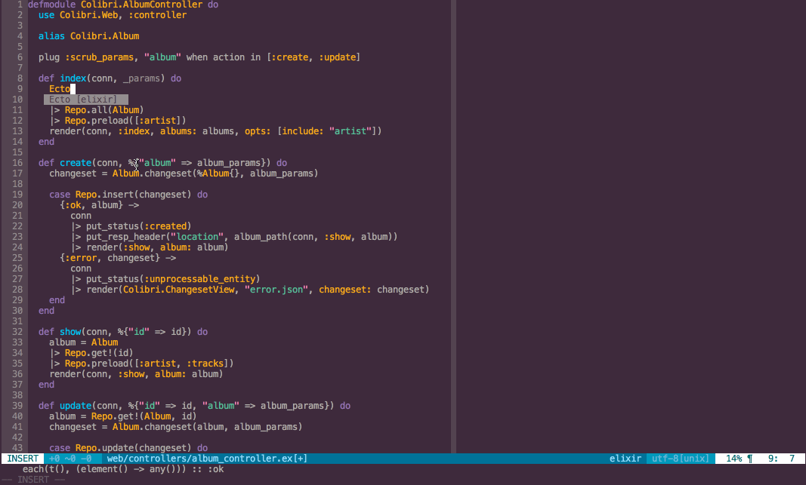

# nvim-elixir (with deoplete support)

This plugin is a repackage of awetzel's excelent vim-elixir fork
(https://github.com/awetzel/vim-elixir/tree/nvim-rplugin).

I found it a bit hard to install, and it didn't work with Shougo's deoplete plugin.
So I forked it, and added a custom source for deoplete. This means that
completion patterns are now happening asynchronously and will not block the
editor like omnicomplete.

# Features

- Load nearest mix project in current file path with `:MixLoad`
- Start the current mix project application inside your vim: `:MixStart`
- Interpret the currently selected Elixir Code with `:ElixirExec`
    - If no line selected, then the whole file is interpreted, useful to dynamically reload current file modules when the app runs with `:MixStart`
    - Bindings are kept along interpretations
    - You can reset binding using the bang: `:ElixirExec!`

# Installation

Install it using the package manager of your choosing (or just copy it into your
vim directory). Then run `:UpdateRemotePlugins` inside your neovim.

Because this fork now contains only neovim specific code, you're advised to also
run the official package (https://github.com/elixir-lang/vim-elixir/) -- this
package is intended only as an enhancement.

